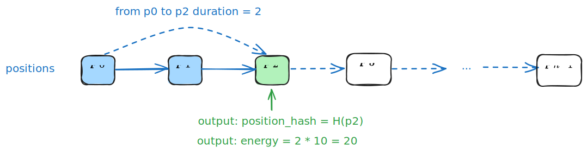
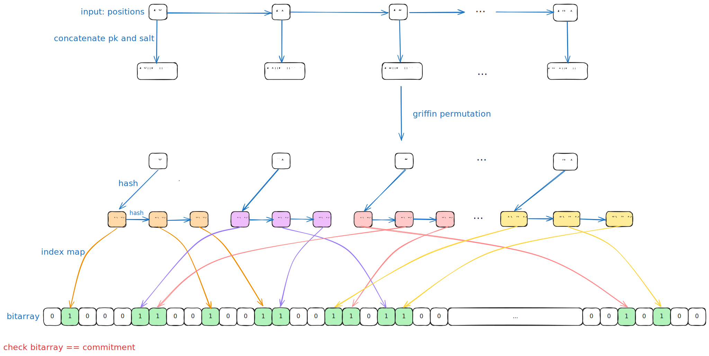

## Dark Route 电路设计

## 电路约束

**Reveal 电路的输入与输出**

电路输入 in:
- private positions[] ：隐私输入，表示的是的一个路径，一次途径的所有点，$p_0 \rightarrow p_1 \rightarrow \ldots \rightarrow p_{n-1}$ 。
- public commitment ：对路径的承诺，一个 `uint256` 的值。
- public duration: 表示从起始点 $p_0$ 出发经历的时间。
- public pk：产生 commitment 者的公钥。
- public salt ：哈希中的 salt。
- public target_occupied：用来表示是否是自己的星球，如果是的话，达到后无待命消耗；否则有待命消耗。

电路输出 out:
- position_hash：输出经过 duration 时间承诺者所在位置对应的哈希值。
- energy (remaining) ：表示经过 duration 时间消耗的总 energy

下图表示是一个简单示例：



**电路约束**
1. 由 positions 计算的承诺与输入 commitment 一致
2. positions 表示的路径之间是相连的
3. 输出 position_hash 根据 duration 正确计算
4. energy 是根据 duration/target_occupied 计算出来的

### TODO
- [ ] griffin permutation 算法，随机数 $\alpha, \beta$ 在每一轮取不同的值
- [ ] salt 和 pk 添加位置，进行拼接
- [ ] bn254 和最后输出 commitment uint256 不匹配问题
- 变成 253 或者 248 位
- [ ] 开根号


### 约束 positions 和 commitment

在电路中根据 positions 计算出一个 commitment，约束其与输入的 commitment 一致。




### 约束 positions

- private positions[] 
表示的是承诺的一个路径，位置坐标，从 A 到 B，一次途径的所有坐标点。
		$$
		p_0 \rightarrow p_1 \rightarrow \ldots \rightarrow p_{n-1}
		$$

需要约束两点之间是相邻的，即

```
// 如果前一个横坐标和后一个点的横坐标不相等，则为 1，否则为 0
flag_x = 1 - IsZero(x_i, x_{i+1})
// 如果前一个纵坐标和后一个点的纵坐标不相等，则为 1，否则为 0
flag_y = 1 - IsZero(y_i, y_{i+1})
```

如果 $x_i \neq x_{i+1}$ ，那么只能是下面两种情况之一：
1. $x_i = x_{i + 1} - 1$
2. $x_i = x_{i + 1} + 1$

### 输出 position

输出的 position 是

## 电路运行

- 检查电路是否有语法错误

```circom
circom reveal.circom
```

- 编译电路

```bash
circom reveal.circom --r1cs --wasm --sym
```

- 使用 WebAssembly计算见证

```shell
node ./reveal_js/generate_witness.js ./reveal_js/reveal.wasm reveal_input.json ./reveal_js/witness.wtns
```


```
node ./multiplier_js/generate_witness.js ./multiplier_js/multiplier.wasm multiplier_input.json ./multiplier_js/witness.wtns
```
- 查看电路信息

```bash
snarkjs info -r reveal.r1cs
```

- 运行以下命令来打印电路的约束： 

```bash
snarkjs r1cs print reveal.r1cs reveal.sym
```

- 仪式
```bash
snarkjs powersoftau new bn128 12 pot_01.ptau -v
```

**阶段 2** 是**特定电路**的。执行以下命令开始该阶段的生成：

```
snarkjs powersoftau prepare phase2 pot_01.ptau pot_final.ptau -v
```

接下来，我们生成一个 `.zkey`文件，其中包含证明和验证密钥以及所有 阶段2的贡献。执行以下命令启动一个新的 zkey：
```
snarkjs groth16 setup reveal.r1cs pot_final.ptau reveal_0000.zkey
```
`snarkjs groth16 setup reveal.r1cs pot_final.ptau reveal_0000.zkey`

为仪式的 阶段2做出贡献：

`snarkjs zkey contribute multiplier2_0000.zkey multiplier2_0001.zkey --name="1st Contributor Name" -v`

导出验证密钥：

`snarkjs zkey export verificationkey reveal_0000.zkey verification_key.json`

### 生成证明

一旦计算出见证并且已经执行了可信设置，我们就可以**生成与电路和见证人相关联的 zk-proof**：

```
snarkjs groth16 prove reveal_0000.zkey ./reveal_js/witness.wtns ./proof/proof.json ./proof/public.json
```

```
snarkjs groth16 prove reveal_0000.zkey ./multiplier_js/witness.wtns ./proof/proof.json ./proof/public.json
```

此命令生成 [Groth16](https://eprint.iacr.org/2016/260) 证明并输出两个文件：

- `proof.json`: 它包含了证明
- `public.json`: 它包含公共输入和输出的值。

参考文档：
- [构建你的第一个零知识 snark 电路（Circom2） — W3.Hitchhiker](https://w3hitchhiker.mirror.xyz/BHJ9fqXMABXspaFxbaDbt9c-PvrQLdi77OjN6Au9YqU)


## 技术选型

### Griffin

参考资料：
- Griffin 算法论文：[Horst](https://eprint.iacr.org/2022/403.pdf)

### VDF

参考资料：
- VDF文章介绍: [研究  可验证延迟函数（VDF）（一）一文搞懂 VDF](https://blog.priewienv.me/post/verifiable-delay-function-1/)
- VDF 论文：[VDF](https://eprint.iacr.org/2018/601.pdf)

若添加VDF，input 改为
- position 
- VDFH(position)
- VDF_proof(position)
电路里验证比较快

### Sloth

sloth 方案：验证比较快

**讨论：有限域中实现 $\sqrt{x}$ 的效率？** 
这个问题实际就是求解二次剩余。

效率总结
- **奇素数域 $\mathbb{F}_p$​**：
    - 如果 $p≡3\mod  4$，使用幂运算 $a^{(p+1)/4}$ 是最快的。时间复杂度为 $O(\log p)$
    - 否则，Tonelli-Shanks ($O(\log^2p)$ 或者 $O(\log p)$) 或 Cipolla 算法是常用选择。
- **特征为 2 的域 $\mathbb{F}_{2^n}$​**：
    - 平方根计算通常更高效，可以利用域的特殊性质。
- **小规模域**：
    - 查表法是最快的。

- Tonelli-Shanks 的 python 实现：[Tonelli-Shanks算法\_python-CSDN博客](https://blog.csdn.net/qq_51999772/article/details/122642868)
- 计算二次剩余的算法描述：[二次剩余 - OI Wiki](https://oi-wiki.org/math/number-theory/quad-residue/)

### Bloom filter

Bloom filter 算法：

- [布隆过滤器BloomFilter基本原理、典型应用及工程实现](https://zhuanlan.zhihu.com/p/559058600)
- zk 实现 bloom filter 代码，arkworks rust 库： [GitHub - Tetration-Lab/arkworks-zk-filter](https://github.com/Tetration-Lab/arkworks-zk-filter/tree/master)
- bloom circom 部分实现：[bloom-circom/circuits/v3\_flag\_propagation/bloom.circom at main · gufett0/bloom-circom · GitHub](https://github.com/gufett0/bloom-circom/blob/main/circuits/v3_flag_propagation/bloom.circom)

### Hash

- circom 实现的 hash 库： [GitHub - bkomuves/hash-circuits: Hashing circuits implemented in circom](https://github.com/bkomuves/hash-circuits)
- circomlib 官方库：[GitHub - iden3/circomlib: Library of basic circuits for circom](https://github.com/iden3/circomlib)
- mimc rust 实现代码：[GitHub - arnaucube/mimc-rs: MiMC hash function](https://github.com/arnaucube/mimc-rs)