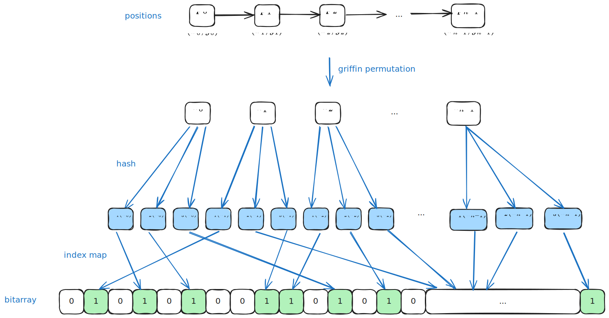

## Dark Route 电路设计

## 电路约束

Reveal 电路

- in
	- private positions[] 
		- 表示的是承诺的一个路径，位置坐标，从 A 到 B，一次途径的所有坐标点。
		$$
		p_0 \rightarrow p_1 \rightarrow \ldots \rightarrow p_{n-1}
		$$
			$$
			(x_0,y_0) \rightarrow (x_1, y_1) \rightarrow \ldots \rightarrow (x_{n-1}, y_{n-1})
			$$
	- public commitment 
		- 位置先做 griffin 的 permutation
			- 先将 $x$ 坐标和 $y$ 坐标相加，再做 permutation
			$$
			\mathsf{griffin}(p_0, \ldots, p_{n-1}) = (h_0,\ldots, h_{n-1})
           $$
		- 再用 bloom filter 对应得到一个 bit 数组，$\mathsf{bitarray}$
		$$
		\mathsf{bitarray}[H_1(h_i)] = 1
		$$
		$$
		\mathsf{bitarray}[H_2(h_i)] = 1
		$$
		$$
		\mathsf{bitarray}[H_3(h_i)] = 1
		$$
			- $H_1, H_2, H_3$ 表示哈希函数，但可以用有限域的乘法和加法操作来模拟
		- 将 $\mathsf{bitarray}$ 转换成一个数输出，如 `uint256`
		- 可能多种哈希
		- mmic 300 总共不超过100k
	- public duration
	- public pk
	- public salt 
	- public target occupied
		- 用来表示是否是自己的星球，如果是的话，达到后无待命消耗；否则有待命消耗，主要影响 remaining energy 的计算
- out
	- position hash
		- 输出的是 duration 对应的 hash
	- energy (remaining)du
		- 表示消耗的 energy

电路约束
- positions 和 commitment 是对应的
- 限制输入的 target occupied 为 bit
- positions 之间是相连的
- energy 是根据duration/occupied计算出来的
- 输出的 position hash 是根据 duration 得到的

### 约束 positions 和 commitment

在电路中根据 positions 计算出一个 commitment，约束其与输入的 commitment 一致。




- mmic 太大
- insert 
- k 次哈希，加法乘法

### 约束 positions

- private positions[] 
表示的是承诺的一个路径，位置坐标，从 A 到 B，一次途径的所有坐标点。
		$$
		p_0 \rightarrow p_1 \rightarrow \ldots \rightarrow p_{n-1}
		$$
			$$
			(x_0,y_0) \rightarrow (x_1, y_1) \rightarrow \ldots \rightarrow (x_{n-1}, y_{n-1})
			$$

需要约束两点之间是相邻的，即

```
// 如果前一个横坐标和后一个点的横坐标不相等，则为 1，否则为 0
flag_x = 1 - IsZero(x_i, x_{i+1})
// 如果前一个纵坐标和后一个点的纵坐标不相等，则为 1，否则为 0
flag_y = 1 - IsZero(y_i, y_{i+1})
```

如果 $x_i \neq x_{i+1}$ ，那么只能是下面两种情况之一：
1. $x_i = x_{i + 1} - 1$
2. $x_i = x_{i + 1} + 1$


## 技术选型

### Griffin

参考资料：
- Griffin 算法论文：[Horst](https://eprint.iacr.org/2022/403.pdf)

### VDF

参考资料：
- VDF文章介绍: [研究  可验证延迟函数（VDF）（一）一文搞懂 VDF](https://blog.priewienv.me/post/verifiable-delay-function-1/)
- VDF 论文：[VDF](https://eprint.iacr.org/2018/601.pdf)

若添加VDF，input 改为
- position 
- VDFH(position)
- VDF_proof(position)
电路里验证比较快

### Sloth

sloth 方案：验证比较快

**讨论：有限域中实现 $\sqrt{x}$ 的效率？** 
这个问题实际就是求解二次剩余。

效率总结
- **奇素数域 $\mathbb{F}_p$​**：
    - 如果 $p≡3\mod  4$，使用幂运算 $a^{(p+1)/4}$ 是最快的。时间复杂度为 $O(\log p)$
    - 否则，Tonelli-Shanks ($O(\log^2p)$ 或者 $O(\log p)$) 或 Cipolla 算法是常用选择。
- **特征为 2 的域 $\mathbb{F}_{2^n}$​**：
    - 平方根计算通常更高效，可以利用域的特殊性质。
- **小规模域**：
    - 查表法是最快的。

- Tonelli-Shanks 的 python 实现：[Tonelli-Shanks算法\_python-CSDN博客](https://blog.csdn.net/qq_51999772/article/details/122642868)
- 计算二次剩余的算法描述：[二次剩余 - OI Wiki](https://oi-wiki.org/math/number-theory/quad-residue/)

## 电路运行

- 检查电路是否有语法错误

```circom
circom reveal.circom
```

- 编译电路

```bash
circom reveal.circom --r1cs --wasm --sym
```

- 使用 WebAssembly计算见证

```shell
node ./reveal_js/generate_witness.js ./reveal_js/reveal.wasm reveal_input.json ./reveal_js/witness.wtns
```

- 查看电路信息

```bash
snarkjs info -r reveal.r1cs
```

- 运行以下命令来打印电路的约束： 

```bash
snarkjs r1cs print reveal.r1cs reveal.sym
```

- 仪式
```bash
snarkjs powersoftau new bn128 12 pot_01.ptau -v
```

**阶段 2** 是**特定电路**的。执行以下命令开始该阶段的生成：

```
snarkjs powersoftau prepare phase2 pot_01.ptau pot_final.ptau -v
```

接下来，我们生成一个 `.zkey`文件，其中包含证明和验证密钥以及所有 阶段2的贡献。执行以下命令启动一个新的 zkey：

`snarkjs groth16 setup reveal.r1cs pot_final.ptau reveal_0000.zkey`

为仪式的 阶段2做出贡献：

`snarkjs zkey contribute multiplier2_0000.zkey multiplier2_0001.zkey --name="1st Contributor Name" -v`

导出验证密钥：

`snarkjs zkey export verificationkey reveal_0000.zkey verification_key.json`

### 生成证明

一旦计算出见证并且已经执行了可信设置，我们就可以**生成与电路和见证人相关联的 zk-proof**：

```
snarkjs groth16 prove reveal_0000.zkey ./reveal_js/witness.wtns ./proof/proof.json ./proof/public.json
```

此命令生成 [Groth16](https://eprint.iacr.org/2016/260) 证明并输出两个文件：

- `proof.json`: 它包含了证明
- `public.json`: 它包含公共输入和输出的值。

参考文档：
- [构建你的第一个零知识 snark 电路（Circom2） — W3.Hitchhiker](https://w3hitchhiker.mirror.xyz/BHJ9fqXMABXspaFxbaDbt9c-PvrQLdi77OjN6Au9YqU)

## Bloom filter

Bloom filter 算法：

- [布隆过滤器BloomFilter基本原理、典型应用及工程实现](https://zhuanlan.zhihu.com/p/559058600)

布隆过滤器可以用于检索一个元素是否在一个集合中。它的优点是空间效率和查询时间都远远超过一般的算法，缺点是有一定的误识别率和删除困难。

假如现在有三个哈希函数分别为h1,h2,h3,同时有三个输入x,y,z。三个输入分别通过h1-h3进行哈希计算出对应整数之后，对bitarray的长度进行取模运算，获取对应下标再进行置1，这样运算三次就形成了如图的bitmap结构：


布隆过滤器检索时，使用相同的哈希函数进行计算出对应的bit位置，只要看这些位置的值，如果这些位置有任何一个0，则被检元素一定不在；如果都是1，则被检元素可能存在。**一句话概率就是有0一定不存在、全1不一定存在。**

**上述过程再用一张图来表示：**


- zk 实现 bloom filter 代码，arkworks rust 库： [GitHub - Tetration-Lab/arkworks-zk-filter](https://github.com/Tetration-Lab/arkworks-zk-filter/tree/master)
- bloom circom 部分实现：[bloom-circom/circuits/v3\_flag\_propagation/bloom.circom at main · gufett0/bloom-circom · GitHub](https://github.com/gufett0/bloom-circom/blob/main/circuits/v3_flag_propagation/bloom.circom)

## Hash

- circom 实现的 hash 库： [GitHub - bkomuves/hash-circuits: Hashing circuits implemented in circom](https://github.com/bkomuves/hash-circuits)
- circomlib 官方库：[GitHub - iden3/circomlib: Library of basic circuits for circom](https://github.com/iden3/circomlib)
- mimc rust 实现代码：[GitHub - arnaucube/mimc-rs: MiMC hash function](https://github.com/arnaucube/mimc-rs)