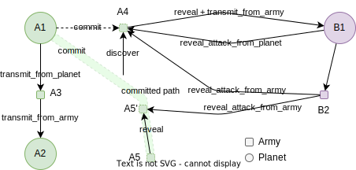

## 故事

Dark Forest创造了全链游戏的fog of war，但是它的fog一旦uncover，就不再神秘，夜幕下的所有动作都是可以被看到的，我们希望创造可以再次遮蔽的fog，将军队的行进路径给遮蔽了，同时我们还希望这个过程更具策略性，可以在中间拦截或者中途撤销。

具体来说，我们使用承诺-揭示（commit-reveal）机制来实现游戏层面的隐私路径， 首先玩家承诺（commit）舰队的移动路径，但在揭示（reveal）前，其他玩家无法直接看到其位置。

这可以创造出更多的游戏策略场景。比如：

- 将军队放在接近敌人星球附近，等待奇袭
- 母星存储量满了，临时寄存到周围
- 中间拦截攻击，或者撤销出发

## 接口

### Blockchain

**Method**
移动路径分为公开移动和隐秘移动两种，隐秘移动遵循Commit-and-Reveal原则。

- Commit(source planet, commitment, energy) -> army id, 承诺自己的移动路径
- Reveal($\pi$, army id, position hash, energy), 揭示路径有效性，如果到达地点为自己的星球，则直接入账，否则转为待命状态
- Reveal Attack From Planet($\pi$, id, position hash, target energy, own planet, own energy), 协助揭示并攻击
- Reveal Attack From Army($\pi$, id, position hash, target energy, own army id), 协助揭示并攻击
- Transmit From Planet(source planet, position hash) -> army id 从源星球明文传输到目标地点
- Transmit From Army(army id, position hash) -> army id 从源星球明文传输到目标地点

**View**
- Discover(hash, x, y, pk) -> 1/0 (possibility)
- List army() -> List\<Army Id\>

### 电路

Reveal电路
- in
	- **private** positions[]
	- **public** commitment
	- **public** duration
	- **public** pk
	- **public** salt
	- **public** target occupied
- out
	- position hash
	- energy (remaining)

规则定义
- energy即运送军队时耗费的资源，同时也是军队本身。
- energy的运送消耗为每单元格10，未到达星球时的待命消耗为1。
- 当energy消耗为0或负时，这支军队无效（消亡）。
- 当target occupied为1时，到达后无待命消耗（因为已到达自己的星球）。

电路约束
- positions之间是相连的
- energy是根据duration/occupied计算出来的
- 针对每一个position，计算累加到bloom filter，并验证最终结果与commitment相等

2种情况：
- duration <= len(positions): energy = len(positions) * 10
- duration > len(positions): len(positions) * 10 + **occupied** ? 0 : (duration - len(positions)) * 1 

## 核心算法

**定义1（discover）**：假设玩家A承诺了$C$，该承诺将用于揭示玩家A的行进路线上经过的所有点集合$S_A$，其他任意玩家猜测一个坐标p，通过$discover(C, p) \to 0/1$方法可以判断坐标$p$是否存在于承诺$C$中。
- **难度要求**：无法加速，无法批量

**方案一（naive实现）：**
Given $H(\cdot)$ is a hash function.
Set $C=\{H(p_0), H(p_1), \dots, H(p_n)\}$, then:
$$
discover(C, p) = \left\{
\begin{array}{ll}
1 & (\text{if } H(p) \in C)\\
0 & (\text{else})
\end{array}
\right.
$$

**方案二（概率型，使用bloom filter）🌟（目前准备使用的方案）：**
Given $BF(\cdot)$ is a bloom filter.
Set $C=BF(\{H(p_0), H(p_1), \dots, H(p_n)\})$, then:
$$
discover(C, p) = \left\{
\begin{array}{ll}
1 & (\text{if } C[H(p)] = 1)\\
0 & (\text{else})
\end{array}
\right.
$$

- 注意：使用概率方案，会导致产生*假阳性*
- 了解 [Bloom Filter](https://gallery.selfboot.cn/en/algorithms/bloomfilter)
- PS1： Cuckoo Filter 是Bloom Filter的变种，支持删除操作，以可能出现假阴性的代价换得更低的假阳性率，并且可以减少哈希次数，在我们的场景中，显然反倒是非常不适合的。
- PS2：Compressed Bloom Filter是Bloom Filter的变种，可以用更大的bitmap降低假阳性，因需解码而降低了查询速度。但是我们的场景不可用，原因是压缩率不定，导致长度不定。
- 两个格子的假阳性的概率就非常低了

**方案x（累加器）：** ❌不可行，因为累加器需要成员证明$w$
Given $ACC(\cdot)$ is a RSA accumulator
Set $C=ACC(\{H(p_0), H(p_1), \dots, H(p_n)\})$ 

## 核心挑战

如果用naive的方式进行电路证明，当bloom filter的k=6时，每个点需要进行7次hash（对点的hash，以及6次 bloom filter的hash），假如使用MiMC Hash，每次Hash需要330个约束，想要在100k约束内实现，最多可以容纳$\frac{100k}{330 \times 7} \approx 43$个点，对游戏来说，这个限制太大了。

本次工作的重点也就在如何拓展可容纳的点数。

我们需要进行两层hash：

- 第一层：将点加盐Hash
- 第二层：将第一层的hash进行k次hash并映射到bloom filter

考虑到我们重点关注点非hash函数的防碰撞性和机密性，因此考虑选择griffin permutation作为一层的hash函数。

第二层基于第一层的hash进行k次hash，因此使用简单的变换，考虑使用基础的加法和乘法进行。

**参考：**

- [griffin](https://github.com/bkomuves/hash-circuits/tree/master/circuits/griffin)

## 核心挑战2

我们其实希望在电路外面用更高的成本来验证每个坐标是否存在于我们的commitment中，但是同时不想增加电路内的验证成本，因此考虑用VDF来实现。

## 🚀 参赛计划

https://ethglobal.com/events/trifecta/prizes

### 一、Aztec

**赞助商对象：** Aztec  
**赛道：** 🥷 **Best Use of Noir**  
- 第一名 $1,500  
- 第二名 $1,000  

**获奖要求：**  

- 使用 Noir 语言实现零知识证明功能，构建创新的链上游戏场景。
- 项目体现 Noir 的技术优势，并阐述 Noir 在应用中的关键作用。
- 鼓励（非必须）使用 Noir 库（如 noir-jwt、zkEmail）或实现跨链功能来获得加分。

---

### 二、t1 Protocol

**赞助商对象：** t1 Protocol  
**赛道：** 🏎️ **Best use of 𝚝𝟷**  
- 第一名 $1,500  
- 第二名 $1,000  

**获奖要求：**  
- 在 t1 Protocol 的 Devnet 上部署你的链上游戏。
- 利用 t1 Protocol 提供的实时证明（Real-time Proving）技术提升游戏用户体验。
- 提交材料需明确说明为何选择 t1 Protocol，以及其技术如何为项目体验带来实质性提升。
